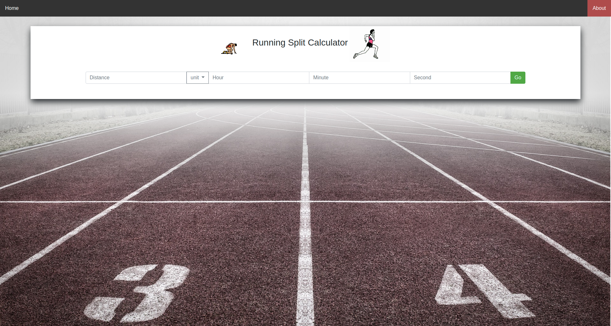
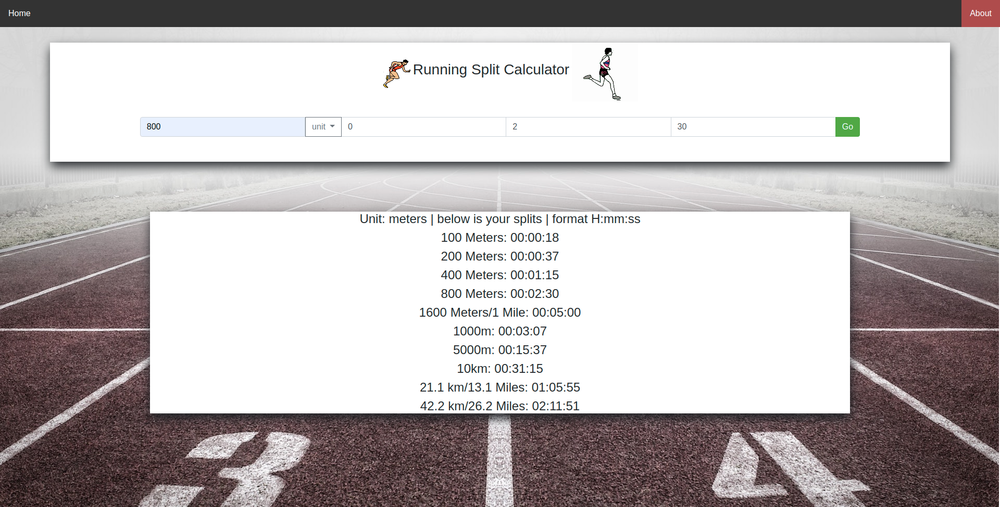
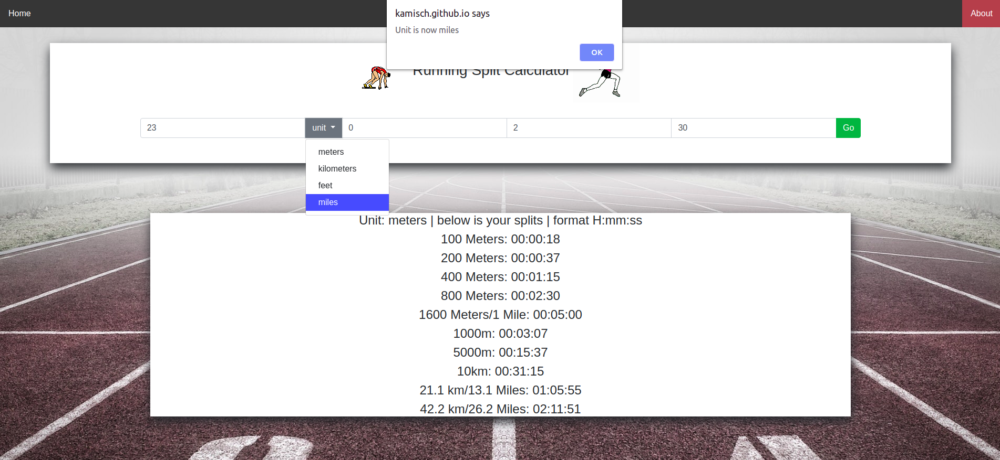
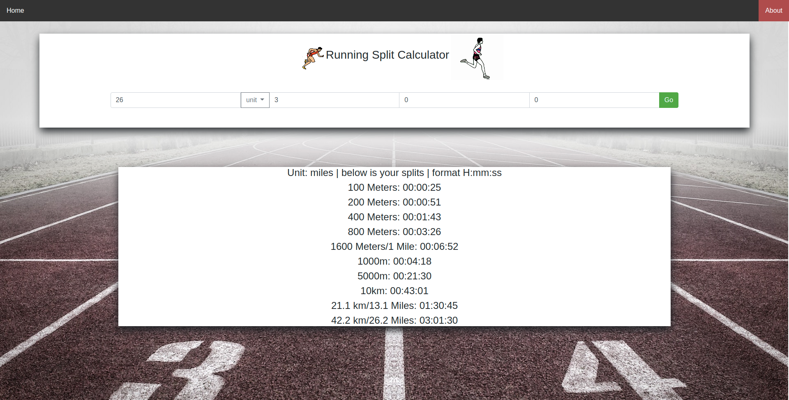

# RunningSplitCalculator
A simple calculator that helps runner find out their running splits and improve their runs

## When to use this calculator
- When you want to see what split you need to run for a PR time that you're trying to achieve. 
- When creating interval workouts and speed trainning.  

## How to use it
- Enter all the input fields, put 0 if input doesn't apply. 
- Click "Go" 

## Demo images
### Main view

### Results

### Changing Units

### Use this to find splits for Boston Marathon

